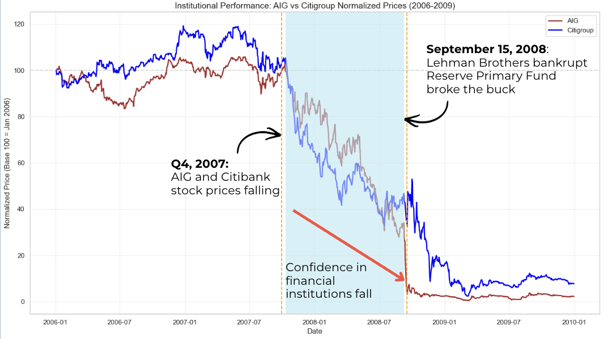
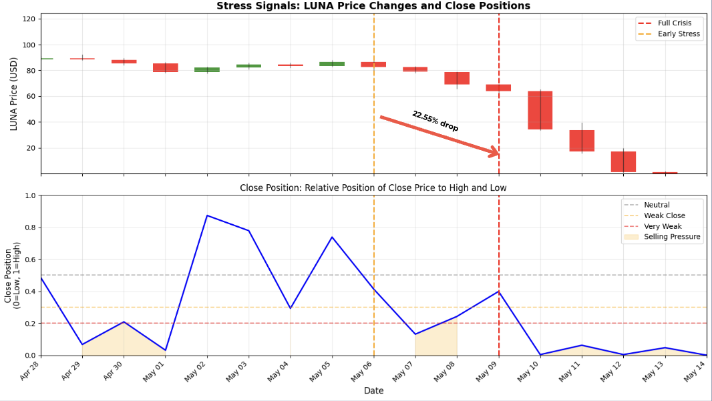
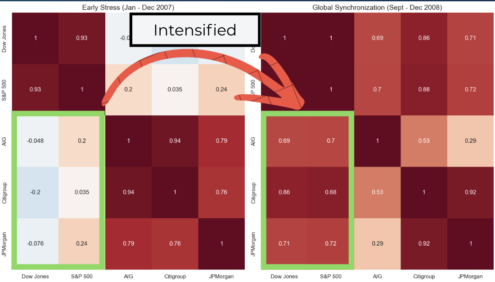
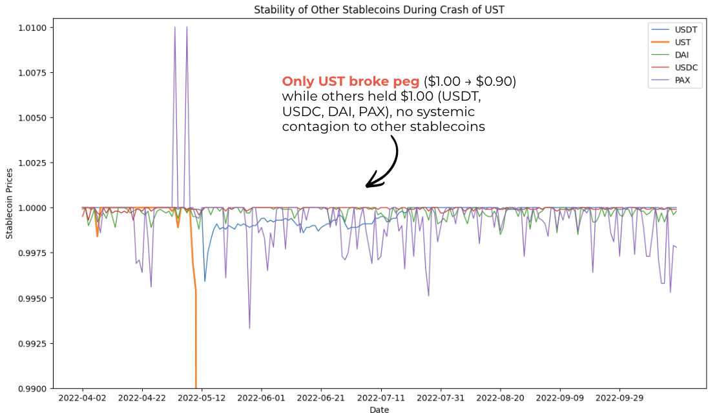
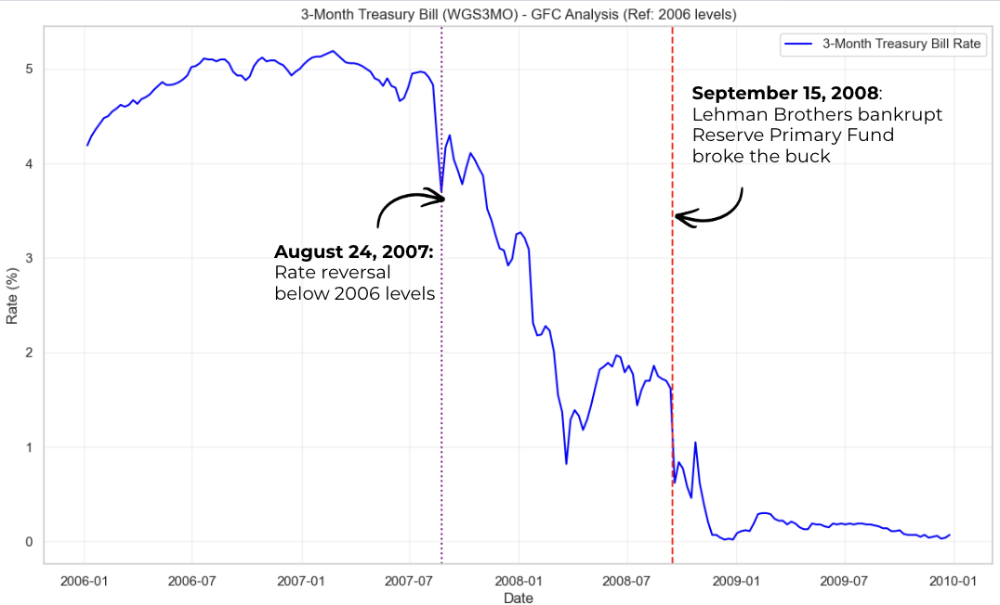
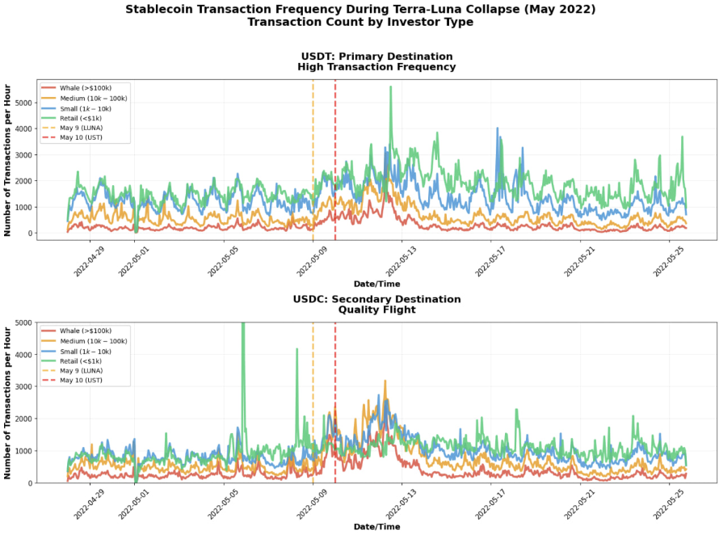
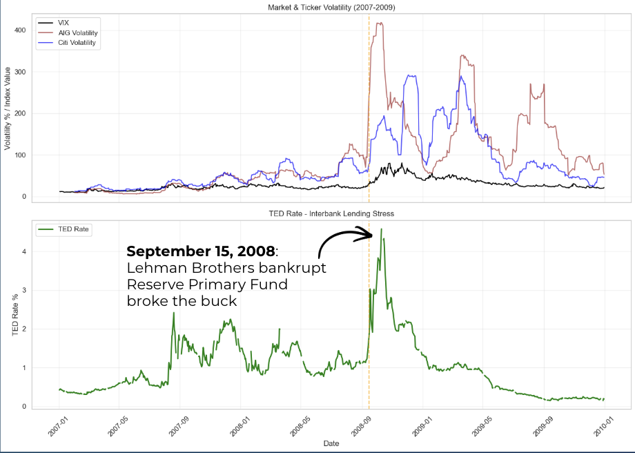
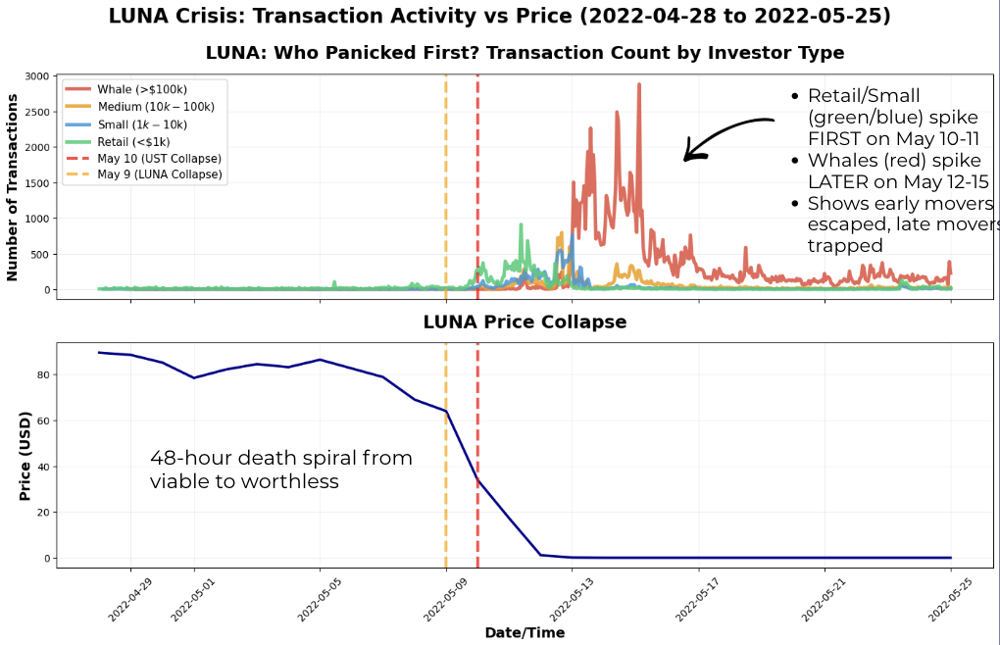

# DataBusters

This repository records our attempt at the NUSxNTU DSE/ECDS Databusters Competition 2026. 

## Databuster 2026 Problem Statement: 

**Investigate whether runs exhibit similar economic dynamics across two radically different institutional settings: the collapse of the Terra-Luna stablecoin system in 2022 and the run on the Reserve Primary Fund during the 2008 Financial Crisis.** 

### Our objective:
To use Terra's on-chain data and money market fund indicators from 2008, analyse how stress emerges, how behavior changes as confidence deteriorates, and how institutional design shaped outcomes. 

## Our Insights: 

#### Core Thesis 1: 
**Pro-cyclical Stress and the Erosion of Confidence. Signs of stress begin when the pro-cyclical feedback loops that drove growth during the "boom" reverse, creating a phase of accelerating stress where stability attempts are overwhelmed by renewed selling pressure.** 
* Global Financial Crisis: Rising mortgage delinquencies from 1.6% to 3.1% triggered a pro-cyclical reversal, where the same housing-linked derivatives that fueled expansion began eroding confidence and driving a sustained decline in the stock prices of Citi and AIG well before the final systemic collapse.
* Terra-Luna: Accelerating downward momentum followed a breach of key support levels, where failed recovery attempts and a "Close Position" indicator below 0.3 signaled a total loss of investor conviction that preceded the terminal crash.

* As single-family mortgage delinquency rate rose from 1.6% (Q1 2006) to 3.1% (Q4 2007)
* Financial institutions with large housing-linked derivative exposures, such as AIG and Citigroup, experienced deteriorating revenues
* This stresses primary market fund whose portfolio were concentrated in commerical paper by financial institutions 

* LUNA continuously breached declining support levels after May 6th . Each breakdown signalling accelerating loss of investor confidence before the official crisis.
* Close Position indicator dropped below 0.3 on May 6th and remained weak, showing accelerating downward momentum that precedes the eventual collapse. 
* Brief recovery attempts (May 2nd-5th) were reversed with close positions spiking above 0.8 then crashing, demonstrating insufficient buying conviction and shook out remaining optimistic holders.

#### Core Thesis 2: 
**Containment Depends on Root Causes:. Panic propagation is determined by whether the root cause is systemic or idiosyncratic; the GFC's reliance on universal credit "plumbing" caused total contagion, whereas Terra-Luna’s algorithmic failure remained largely isolated to its own ecosystem.**
* Since the root cause was embedded in the core banking system, panic propagated from specific institutions like AIG and Citi to the broader S&P 500, where panic spread well out of the financial system
* Despite the total collapse of UST, the panic was highly contained within the algorithmic space; while UST broke its peg to $0.90, other major fiat-backed stablecoins like USDT, USDC, and DAI maintained their $1.00 pegs with no systemic contagion.

* During the early stress periods, stock prices between financial institutions (JPM, AIG, Citi) and industrial related firms (S&P, Dow Jones) were weakly correlated
* Correlation intensified after Lehman Brothers’ collapse suggesting:
    * Panic spreading outside financial system
    * Panic taking over as main drivers of stock price (mostly selling)

* Panic propogation would be more evident if the collapse of the UST led to the de-pegging of other stablecoins. 
* Panic propagated through targeted capital flight from algorithmic UST to reserve-backed stablecoins, which helped these stablecoins maintain their peg.
* This pattern indicates that the panic was contained between the UST-LUNA markets. This aligns with rational market behavior rather than systemic contagion.

#### Core Thesis 3: 
**In moments of systemic crisis, investor behavior shifts from seeking yield to seeking safety, triggering a massive migration of capital out of risky assets and back into fiat-backed instruments with deep liquidity and government or cash-equivalent backing.**
* Global Financial Crisis: As confidence in housing-linked derivatives evaporated, investors liquidated risky financial assets like AIG and Citi to flood into U.S. Treasury Bills, eventually driving interest rates to the "Zero Lower Bound" as capital preservation overrode all other priorities.
* Terraluna: Following the breach of key support levels and a collapse in investor conviction, capital fled the algorithmic ecosystem in favor of fiat-backed stablecoins like USDT, which saw peak inflows exceeding $1 billion as investors prioritized market depth and stability.

**Destination:** Treasury Bills → Safe-haven

**Primary source:** Financial assets

**Peak inflow:**  After the Lehman Brothers collapse, T-bill rates hit the "Zero Lower Bound” → Demand for T-bills were so high that its interest rate effectively vanished

**Key insight:** During runs, capital preservation overrode yield seeking; investors accepted near-zero returns to avoid counterparty risk

**Primary Destination:** USDT Stablecoin (Fiat-backed stable coins)

**Peak inflow:** More than 5000 transactions/hour, amounting to over $1 billion. Inflow was larger than LUNA exit. 

**This implied:**
* Investors were dumping LUNA for USDT simultaneously
* USDT captured a wider capital flight from multiple risky assets into USDT
* Investors prioritised liquidity and market depth for safety
* USDC, DAI and PAX saw the same trend, albeit to a smaller degree

#### Core Thesis 4: 
**The severity of a crisis is ultimately defined by the presence or absence of a credible Buyer of Last Resort. The GFC’s centralized design allowed for a massive intervention to stabilize the system, whereas Terra-Luna’s decentralized, algorithmic design lacked a functional backstop, leading to a total value collapse.**
* Global Financial Crisis: Federal intervention stabilized the system after the Reserve Primary Fund "broke the buck" at $0.97, absorbing panic by allowing capital to migrate into 0% interest T-bills backed by the government.
* Terra-Luna (Decentralized Failure): Lacking a lender of last resort, an under-collateralized reserve (17% coverage) failed to stop an irreversible 48-hour death spiral, resulting in hyperinflation and a 90-100% loss for the majority of holders.

* The run on the Reserve Primary Fund triggered a systemic credit freeze, creating two primary groups of "losers".
1. Equity stakeholders 
    * Broad market and institutional shareholders saw the value of their holdings collapse as counterparty trust evaporated
2. Interbank borrowers and creditors
    * TED Rate surged to a peak of nearly 4.5% ⟶ Companies relying on the the Reserve Primary Fund to fund daily operations lost access to cash as the interbank lending market froze

* During the collapse, 75-85% of holders lost 90-100% of their investment due to fundamental design flaws in the algorithmic stablecoin mode
* The system couldn't protect users because UST was under-collateralised with just $3.2B reserves for $18.7B in liabilities (17%), creating an irreversible death spiral once panic began
* Each UST redemption minted new LUNA tokens, causing hyperinflation (350M→6.5 trillion supply) that crashed LUNA's price. Late-moving whales were trapped by evaporated liquidity and could not exit their postions without causing a further decline in the price. 